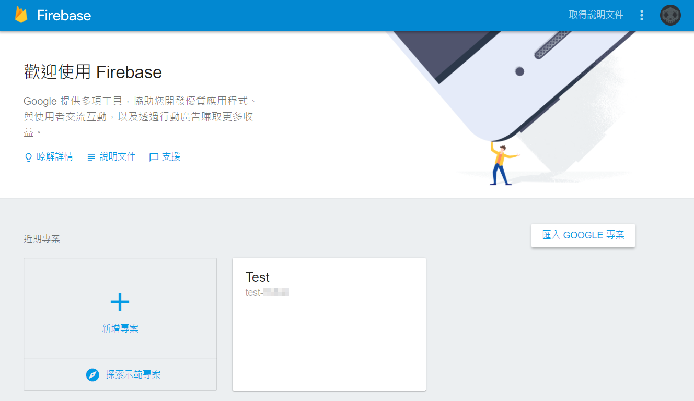
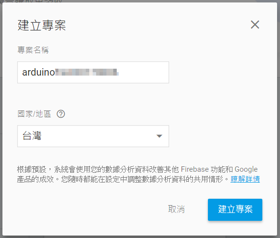
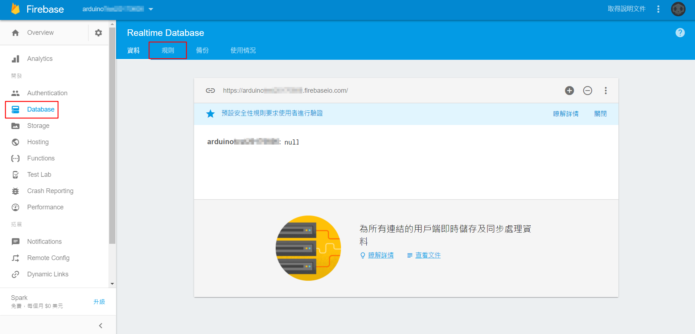
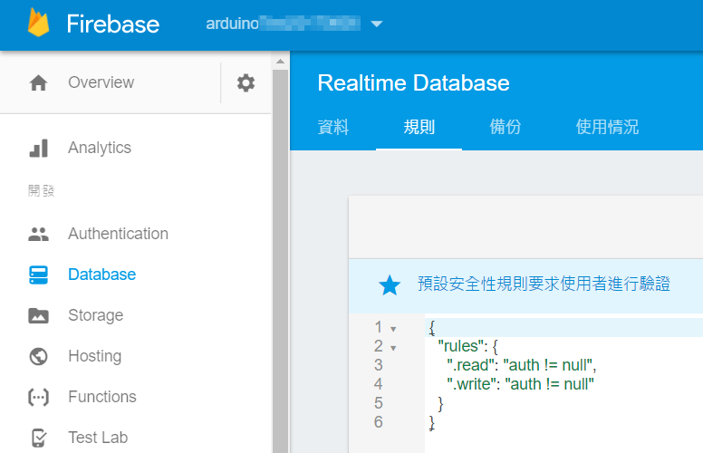
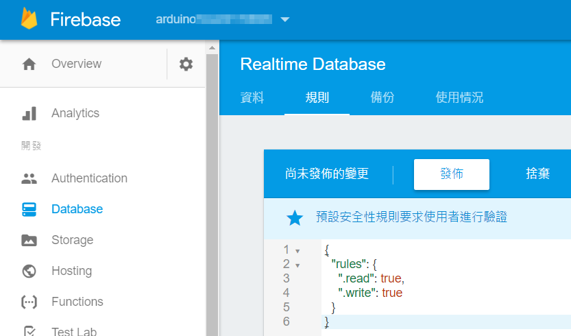
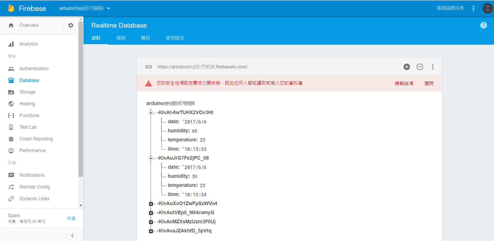

# [利用 Firebase 記錄溫濕度](./Humidity_Temperature-Firebase.html)

## 新建立 Firebase 專案
### 新增專案
<a href="../image/Humidity_Temperature-Firebase_1.png" target="_blank"></a>

### 輸入專案名稱、國家 / 地區
<a href="../image/Humidity_Temperature-Firebase_2.png" target="_blank"></a>

## 設定 Firebase 規則
點選左邊選單的「Database」，再點選「規則」
<a href="../image/Humidity_Temperature-Firebase_3.png" target="_blank"></a>

原本的規則長這樣，預設的帳號規則是「不能為 null」
```json
{
    "rules": {
        ".read": "auth != null",
        ".write": "auth != null"
    }
}
```
<a href="../image/Humidity_Temperature-Firebase_4.png" target="_blank"></a>

先將規則設為公開狀態方便測試，修改後點選「發佈」 (測試完後記得將規則改回 `"auth != null"`)
```json
{
    "rules": {
        ".read": true,
        ".write": true
    }
}
```
<a href="../image/Humidity_Temperature-Firebase_5.png" target="_blank"></a>


```javascript
var dht, myFirebase;
var temperature = document.getElementById("temperature");
var humidity = document.getElementById("humidity");

boardReady({device: 'kzpV'}, board => {
    board.systemReset();
    board.samplingInterval = 20;
    dht = getDht(board, 10);
    myFirebase = new Firebase("https://<Your-Firebase>.firebaseio.com/");
    dht.read(evt => {
        temperature.innerHTML = dht.temperature;
        humidity.innerHTML = dht.humidity;
        myFirebase.push({
            date: get_date(),
            time: get_time(),
            temperature: dht.temperature,
            humidity: dht.humidity
        });
    }, 1000);
});

function get_date() {
    var nowDay = new Date(),
        nowYear = nowDay.getFullYear(),
        nowMonth = nowDay.getMonth() + 1,
        nowDate = nowDay.getDate();
    return nowYear + "/" + nowMonth + "/" + nowDate;
}
  
function get_time() {
    var nowTime = new Date(),
        nowHours = nowTime.getHours(),
        nowMinutes = nowTime.getMinutes(),
        nowSeconds = nowTime.getSeconds();
    return nowHours + ":" + nowMinutes + ":" + nowSeconds;
}
```

## Demo
<a href="../image/Humidity_Temperature-Firebase_6.png" target="_blank"></a>