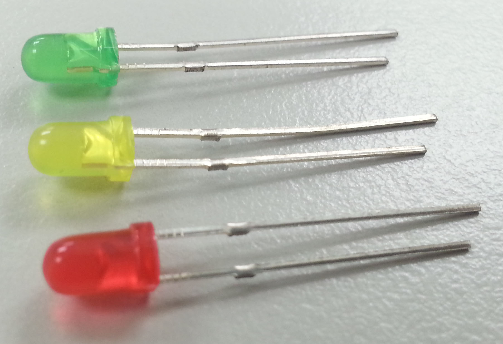
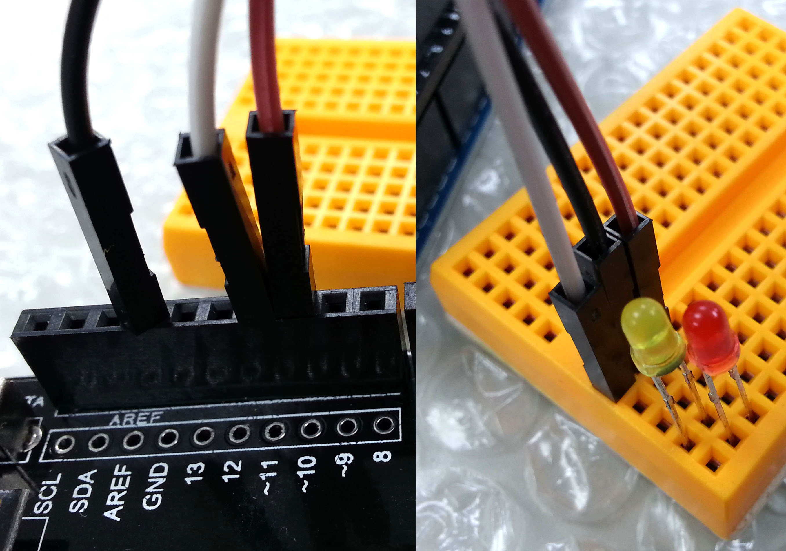
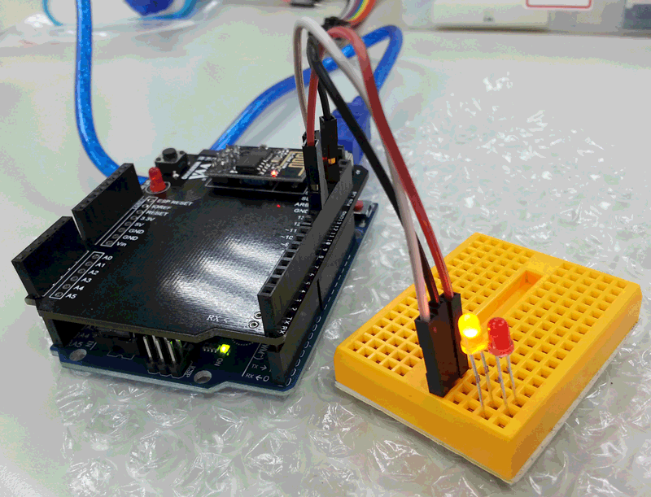

# LED
<a href="./image/LED.jpg" target="_blank"></a>

[Webduino 官方教學範例 - LED 燈](https://webduino.io/tutorials/tutorial-01-led.html)

## [燈泡圖片亮 & LED 燈亮](./LED_bright.html)
- GND (接地)：LED 短腳
- 13：LED 長腳

實際接線照片：

<a href="./image/LED_bright.jpg" target="_blank"></a>

```javascript
var led;

boardReady({device: 'wa8w'}, board => {
    board.systemReset();
    board.samplingInterval = 250;
    led = getLed(board, 13);
    led.on();
    document.getElementById("light").className = "on";
});
```

## [點擊燈泡圖片切換 LED 燈開關](./Switch_LED.html)
- GND (接地)：LED 短腳
- 13：LED 長腳

```javascript
var led;
var light = document.getElementById("light");

boardReady({device: 'wa8w'}, board => {
    board.systemReset();
    board.samplingInterval = 250;
    led = getLed(board, 13);
    led.off();
    light.className = "off";
    light.addEventListener("click", () => {
        led.toggle();
        light.className = light.className == "on" ? "off" : "on";
    });
});
```

## [黃亮紅不亮，黃不亮紅亮 切換](./Click_Switch_Yellow-Red_LED.html)
- GND (接地)：LED 短腳
- 10：紅 LED 長腳
- 11：黃 LED 長腳

實際接線照片：

<a href="./image/Click_Switch_Yellow-Red_LED_1.jpg" target="_blank"></a>

## 點擊燈泡圖片 切換
```javascript
var led_red, led_yellow;
var light = document.getElementById("light");

boardReady({device: 'wa8w'}, board => {
    board.systemReset();
    board.samplingInterval = 250;
    led_red = getLed(board, 10);
    led_yellow = getLed(board, 11);
    led_red.off();
    led_yellow.on();
    light.className = "off";
    light.addEventListener("click", () => {
        led_red.toggle();
        led_yellow.toggle();
        light.className = light.className == "on" ? "off" : "on";
    });
});
```

## 自動間隔幾秒後 切換
```javascript
var led_red, led_yellow;
var light = document.getElementById("light");

boardReady({device: 'wa8w'}, board => {
    board.systemReset();
    board.samplingInterval = 250;
    led_red = getLed(board, 10);
    led_yellow = getLed(board, 11);
    led_red.off();
    led_yellow.on();
    light.className = "off";
    setInterval(() => {
        led_red.toggle();
        led_yellow.toggle();
        light.className = light.className == "on" ? "off" : "on";
    }, 2000);
});
```

## Demo

<a href="./image/Click_Switch_Yellow-Red_LED_2.gif" target="_blank"></a>