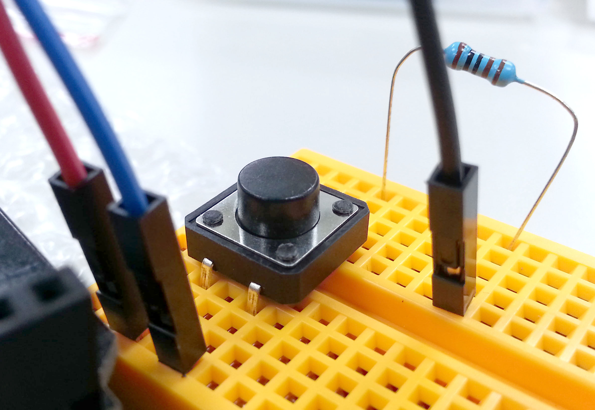
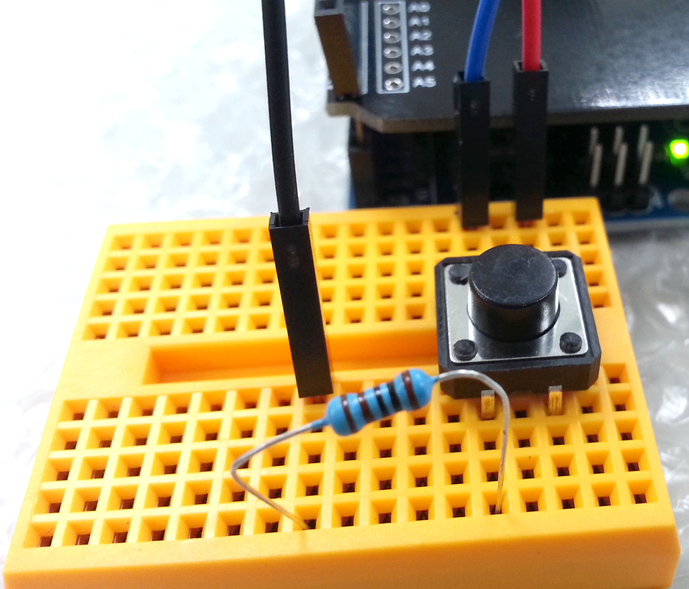

# webduino-learn
# [LED](./LED)
<a href="./image/LED.jpg" target="_blank"></a>

[Webduino 官方教學範例 - LED 燈](https://webduino.io/tutorials/tutorial-01-led.html)

## [燈泡圖片亮 & LED 燈亮](./LED/LED_bright.html)
### 接線
- GND (接地)：LED 短腳
- 13：LED 長腳

### 實際接線照片
<a href="./image/LED_bright.jpg" target="_blank"></a>

```javascript
var led;

boardReady({device: 'wa8w'}, board => {
    board.systemReset();
    board.samplingInterval = 250;
    led = getLed(board, 13);
    led.on();
    document.getElementById("light").className = "on";
});
```

---

## [點擊燈泡圖片切換 LED 燈開關](./LED/Switch_LED.html)
### 接線
- GND (接地)：LED 短腳
- 13：LED 長腳

```javascript
var led;
var light = document.getElementById("light");

boardReady({device: 'wa8w'}, board => {
    board.systemReset();
    board.samplingInterval = 250;
    led = getLed(board, 13);
    led.off();
    light.className = "off";
    light.addEventListener("click", () => {
        led.toggle();
        light.className = light.className == "on" ? "off" : "on";
    });
});
```

---

## 黃亮紅不亮，黃不亮紅亮 切換
### 接線
- GND (接地)：LED 短腳
- 10：紅 LED 長腳
- 11：黃 LED 長腳

### 實際接線照片
<a href="./image/Click_Switch_Yellow-Red_LED_1.jpg" target="_blank"></a>

### [點擊燈泡圖片 切換](./LED/Click_Switch_Yellow-Red_LED.html)
```javascript
var led_red, led_yellow;
var light = document.getElementById("light");

boardReady({device: 'wa8w'}, board => {
    board.systemReset();
    board.samplingInterval = 250;
    led_red = getLed(board, 10);
    led_yellow = getLed(board, 11);
    led_red.off();
    led_yellow.on();
    light.className = "off";
    light.addEventListener("click", () => {
        led_red.toggle();
        led_yellow.toggle();
        light.className = light.className == "on" ? "off" : "on";
    });
});
```

---

### [自動間隔幾秒後 切換](./LED/Auto_Switch_Yellow-Red_LED.html)
```javascript
var led_red, led_yellow;
var light = document.getElementById("light");

boardReady({device: 'wa8w'}, board => {
    board.systemReset();
    board.samplingInterval = 250;
    led_red = getLed(board, 10);
    led_yellow = getLed(board, 11);
    led_red.off();
    led_yellow.on();
    light.className = "off";
    setInterval(() => {
        led_red.toggle();
        led_yellow.toggle();
        light.className = light.className == "on" ? "off" : "on";
    }, 2000);
});
```

### Demo
<a href="./image/Click_Switch_Yellow-Red_LED_2.gif" target="_blank"></a>

---

## [紅綠燈](./LED/Traffic-light.html)

### 接線
- GND (接地)：LED 短腳
- 10：紅 LED 長腳
- 11：黃 LED 長腳
- 7：綠 LED 長腳

### 實際接線照片
<a href="./image/Auto_Switch_Yellow-Red_LED_1.jpg" target="_blank"></a>
<a href="./image/Auto_Switch_Yellow-Red_LED_2.jpg" target="_blank"></a>

說明：
- 開始綠燈亮，可按 點擊燈泡圖片 切換 紅燈 或 綠燈 狀態
- 切換紅燈狀態：點擊燈泡圖片 2 秒後換黃燈亮 (其他不亮)，再 2 秒後換紅燈亮 (其他不亮)
- 切換綠燈狀態：點擊燈泡圖片 2 秒後換綠燈亮 (其他不亮)

```javascript
(async function () {
    var led_red, led_yellow, led_green;
    var light = document.getElementById("light");

    boardReady({device: 'wa8w'}, async board => {
        board.systemReset();
        board.samplingInterval = 250;
        led_red = getLed(board, 10);
        led_yellow = getLed(board, 11);
        led_green = getLed(board, 7);
        led_red.off();
        led_yellow.off();
        led_green.on();
        light.className = "off";
        light.addEventListener("click", async () => {
            if (light.className == "off") {
                await delay(2);
                led_red.off();
                led_yellow.on();
                led_green.off();
                await delay(2);
                led_red.on();
                led_yellow.off();
                led_green.off();
                light.className = light.className == "on" ? "off" : "on";
            } else {
                await delay(2);
                led_red.off();
                led_yellow.off();
                led_green.on();
                light.className = light.className == "on" ? "off" : "on";
            }
        });
    });
}());
```

### Demo
<a href="./image/Auto_Switch_Yellow-Red_LED_3.jpg" target="_blank"></a>

---

# [超音波 (Ultrasonic HC-SRO4+)](./Ultrasonic_(HC-SRO4%2B))
<a href="./image/HC-SRO4+.jpg" target="_blank"></a>

- VCC：供應電源 (3 ~ 5.5V)
- Trig：超音波觸發信號，訊號發送出去
- Echo：超音波接收結果輸出
- GND：接地

## 接線
- VCC：3.3V
- Trig：11
- Echo：10
- GND：GND

## 實際接線照片
<a href="./image/HC-SRO4+_1.jpg" target="_blank"></a>
<a href="./image/HC-SRO4+_2.jpg" target="_blank"></a>

## [超音波 顯示 擷取距離](./Ultrasonic_(HC-SRO4%2B)/Get_Distance.html)

```javascript
var ultrasonic;

boardReady({device: 'kzpV'}, board => {
    board.systemReset();
    board.samplingInterval = 250;
    ultrasonic = getUltrasonic(board, 11, 10);
    ultrasonic.ping(cm => {
        console.log(ultrasonic.distance);
        document.getElementById("show").innerHTML = ultrasonic.distance;
    }, 500);
});
```

## [利用 超音波 擷取距離 縮放圖片大小](./Ultrasonic_(HC-SRO4%2B)/Get_Distance_Zoom_Picture.html)

```javascript
var ultrasonic;

boardReady({device: 'kzpV'}, board => {
    board.systemReset();
    board.samplingInterval = 250;
    ultrasonic = getUltrasonic(board, 11, 10);
    ultrasonic.ping(cm => {
        console.log(ultrasonic.distance);
        var imageWidth = ultrasonic.distance;
        var imageHeight = ultrasonic.distance;
        document.getElementById("image").style.width = imageWidth+"px";
        document.getElementById("image").style.height = imageHeight+"px";
    }, 500);
});
```

---

# [三色 LED (RGB LED)](./RGB_LED)
<a href="./image/RGB_LED.jpg" target="_blank"></a>

[Webduino 官方教學範例 - 三色 LED](https://webduino.io/tutorials/tutorial-03-rgbled.html)

## 接線
- V：3.3V
- R：10
- B：6
- G：9

## 實際接線照片
<a href="./image/RGB_LED_1.jpg" target="_blank"></a>
<a href="./image/RGB_LED_2.jpg" target="_blank"></a>
<a href="./image/RGB_LED_3.jpg" target="_blank"></a>
<a href="./image/RGB_LED_4.jpg" target="_blank"></a>

---

## [選擇某顏色就變該顏色](./RGB_LED/RGB_LED_Change_Color.html)

```javascript
var rgbled;

boardReady({device: 'wa8w'}, board => {
    board.systemReset();
    board.samplingInterval = 250;
    rgbled = getRGBLed(board, 10, 9, 6);
    document.getElementById("color").oninput = _color => {
        _color = this.value;
        rgbled.setColor(_color);
    };
});
```

### Demo
<a href="./image/RGB_LED_Change_Color.png" target="_blank"></a>

---

## [點擊按鈕變顏色](./RGB_LED/RGB_LED_Click_Button_Change_Color.html)

```javascript
var rgbled;

boardReady({device: 'wa8w'}, board => {
    board.systemReset();
    board.samplingInterval = 250;
    rgbled = getRGBLed(board, 10, 9, 6);
    rgbled.setColor('#000000');
    document.getElementById("show").style.background = '#000';
    changeColor("redBtn", '#f00');
    changeColor("greenBtn", '#3f3');
    changeColor("blueBtn", '#33f');
    changeColor("clearBtn", '#000');
});

function changeColor(btn, color) {
    document.getElementById(btn).addEventListener("click",() => {
        rgbled.setColor(color);
        document.getElementById("show").style.background = color;
    });
}
```

### Demo
<a href="./image/RGB_LED_Click_Button_Change_Color.png" target="_blank"></a>

---

## [利用拉霸調整顏色](./RGB_LED/RGB_LED_SliderBar_Change_Color.html)

```javascript
var rgbled;
var color = {"red": "00", "green": "00", "blue": "00"};

boardReady({device: 'wa8w'}, board => {
    board.systemReset();
    board.samplingInterval = 250;
    rgbled = getRGBLed(board, 10, 9, 6);
    rgbled.setColor('#000');
    document.getElementById("show").style.background = '#000';
    document.getElementById("red").addEventListener("change", changeColor);
    document.getElementById("green").addEventListener("change", changeColor);
    document.getElementById("blue").addEventListener("change", changeColor);
});

function changeColor(e) {
    var id = e.target.id;
    color[id] = e.target.value * 1;
    color[id] = color[id] < 17 ? "0" + color[id].toString(16) : color[id].toString(16);
    var rgb = "#" + color.red + color.green + color.blue;
    rgbled.setColor(rgb);
    document.getElementById("show").style.background = rgb;
}
```

### Demo
<a href="./image/RGB_LED_SliderBar_Change_Color.png" target="_blank"></a>

---

## [七彩霓虹燈 - 利用時間改變三色 LED 燈顏色](./RGB_LED/RGB_LED_Colorful_Neon_lighting.html)

```javascript
var rgbled, timer, time = 300;
var light = document.getElementById("light");

boardReady({device: 'wa8w'}, board => {
    board.systemReset();
    board.samplingInterval = 250;
    rgbled = getRGBLed(board, 10, 9, 6);
    rgbled.setColor('#000');
    light.setAttribute("class","off");
    light.addEventListener("click", () => {
        if (light.getAttribute("class") == "off") {
            light.setAttribute("class", "on");
            rgbled.setColor('#000');
            repeat();
        } else {
            light.setAttribute("class", "off");
            rgbled.setColor('#000');
            clearTimeout(timer);
        }
    });
});

function delay(time) {
    return new Promise(resolve => timer = setTimeout(resolve, time));
}

function repeat() {
    delay(1).then(() => { rgbled.setColor('#f00'); return delay(time);
    }).then(() => { rgbled.setColor('#f90'); return delay(time);
    }).then(() => { rgbled.setColor('#ff3'); return delay(time);
    }).then(() => { rgbled.setColor('#3f3'); return delay(time);
    }).then(() => { rgbled.setColor('#33f'); return delay(time);
    }).then(() => { rgbled.setColor('#c6c'); return delay(time);
    }).then(() => repeat());
}
```

---

# [三色 LED (RGB LED) & 超音波 (Ultrasonic HC-SRO4+)](./RGB_LED&Ultrasonic_(HC-SRO4%2B))

## 接線
- 三色LED
    - V：3.3V
    - R：10
    - B：6
    - G：9
- 超音波
    - VCC：5V
    - Trig：7
    - Echo：8
    - GND：GND

## 實際接線照片
<a href="./image/RGB_LED&HC-SRO4+_2.jpg" target="_blank"></a>
<a href="./image/RGB_LED&HC-SRO4+_3.jpg" target="_blank"></a>
<a href="./image/RGB_LED&HC-SRO4+_1.jpg" target="_blank"></a>
<a href="./image/RGB_LED&HC-SRO4+_5.jpg" target="_blank"></a>
<a href="./image/RGB_LED&HC-SRO4+_4.jpg" target="_blank"></a>

## [利用超音波改變三色 LED 燈顏色](./RGB_LED&Ultrasonic_(HC-SRO4%2B)/Ultrasonic_Change_RGB_LED_Color.html)

```javascript
var rgbled, ultrasonic, i = 0;
var color = ["#f00", "#f90", "#ff0", "#3f3", "#33f", "#c6c"];
var show = document.getElementById("show");

boardReady({device: 'kzpV'}, board => {
    board.systemReset();
    board.samplingInterval = 250;
    rgbled = getRGBLed(board, 10, 9, 6);
    ultrasonic = getUltrasonic(board, 7, 8);
    rgbled.setColor('#000');
    show.style.background = '#000';
    ultrasonic.ping(cm => {
        console.log(ultrasonic.distance);
        i = Math.floor(ultrasonic.distance / 10);
        if (ultrasonic.distance < 50) {
            rgbled.setColor(color[i]);
            show.style.background = color[i];
        } else {
            rgbled.setColor(color[5]);
            show.style.background = color[5];
        }
    }, 500);
});
```

---

# [按鈕開關 (Button)](./Button)
<a href="./image/Button.jpg" target="_blank"></a>

[Webduino 官方教學範例 - 按鈕開關](https://webduino.io/tutorials/tutorial-09-button-led.html)

## 接線
利用麵包板中間斷路的設計，將按鈕開關各邊的兩腳橫跨兩邊，才能讓四腳都通路，然後再用電阻連接 GND (為了避免有短路的可能發生，所以要接一顆電阻進行保護)

- 按鈕
    - 3.3V
    - 11
    - 按鈕 → 電阻 → GND

## 實際接線照片
<a href="./image/Button_1.jpg" target="_blank"></a>
<a href="./image/Button_2.jpg" target="_blank"></a>
<a href="./image/Button_3.jpg" target="_blank"></a>
<a href="./image/Button_4.jpg" target="_blank"></a>
<a href="./image/Button_5.jpg" target="_blank"></a>

## [監聽按鈕動作 (按下、按住、長按)](./Button/Listen_Button_Action.html)

```javascript
var button;
var show = document.getElementById("show");

boardReady({device: 'kzpV'}, board => {
    board.systemReset();
    board.samplingInterval = 250;
    button = getButton(board, 11);
    button.on("pressed", () => show.innerHTML = '按下');
    button.on("released", () => show.innerHTML = '放開');
    button.on("longPress", () => show.innerHTML = '長按');
});
```

---

## [按鈕 按下 + 1、按住 歸 0](./Button/Button_Press_Count.html)

```javascript
var button, count = 0;
var show = document.getElementById("show");

boardReady({device: 'kzpV'}, board => {
    board.systemReset();
    board.samplingInterval = 250;
    button = getButton(board, 11);
    show.innerHTML = 0;
    button.on("pressed", () => show.innerHTML = count++);
    button.on("longPress", () => show.innerHTML = count = 0);
});
```

---

## [按按鈕 比賽跑](./Button/Button_Press_Count.html)

```javascript
var button;
var NpcShow = document.getElementById("npcshow"),
    UserShow = document.getElementById("usershow"),
    Npc = document.getElementById("npc"),
    User = document.getElementById("user"),
    Start = document.getElementById("start"),
    Timer, GameA = 0, GameB = 0,
    Distance = 100,
    NpcSpeed = 2, UserSpeed;

boardReady({device: 'wa8w'}, function (board) {
    board.systemReset();
    board.samplingInterval = 250;
    button = getButton(board, 11);

    Start.className = "";
    document.getElementById("goal").innerHTML = Distance;
    Start.addEventListener("click",go);
});

function go() {
    Start.className = "go";
    GameA = 0, GameB = 0;
    button.on("pressed", userRun);
    Timer = setInterval(NPCRun, 120);
}

function userRun() {
    UserShow.innerHTML = GameA += 5;
    User.style.marginLeft = GameA + "px";
    if (GameA >= Distance) {
        alert("You Win !!!");
        stop();
    }
}

function NPCRun() {
    NpcShow.innerHTML = GameB += NpcSpeed;
    Npc.style.marginLeft = GameB + "px";
    if (GameB >= Distance) {
        alert("GAME OVER !!! You Lose !!!");
        stop();
    }
}

function stop() {
    clearInterval(Timer);
    GameA = 0, GameB = 0;
    NpcShow.innerHTML = 0;
    UserShow.innerHTML = 0;
    Npc.style.marginLeft = 0;
    User.style.marginLeft = 0;
    Start.className = "";
    button.removeAllListeners("pressed");
}
```

### DemoDemo
<a href="./image/Press_Button_Race_Run.png" target="_blank"></a>