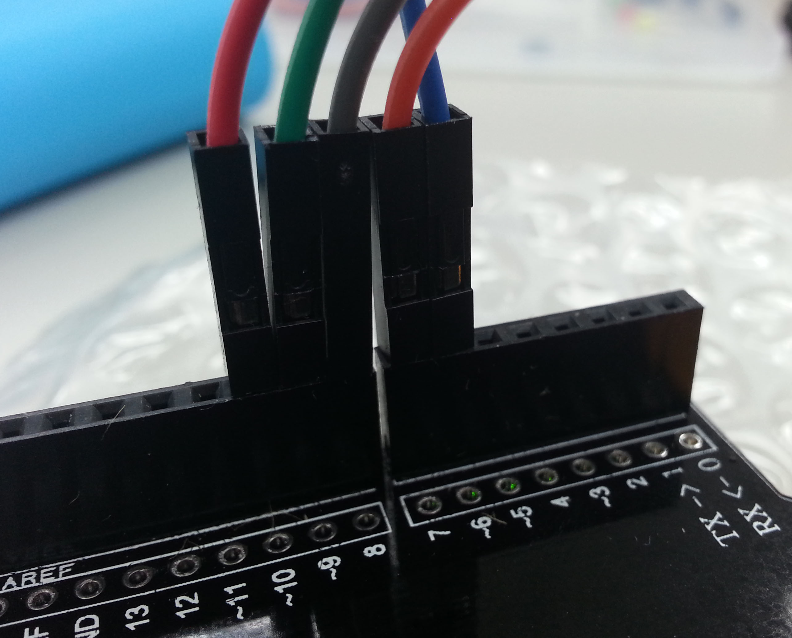
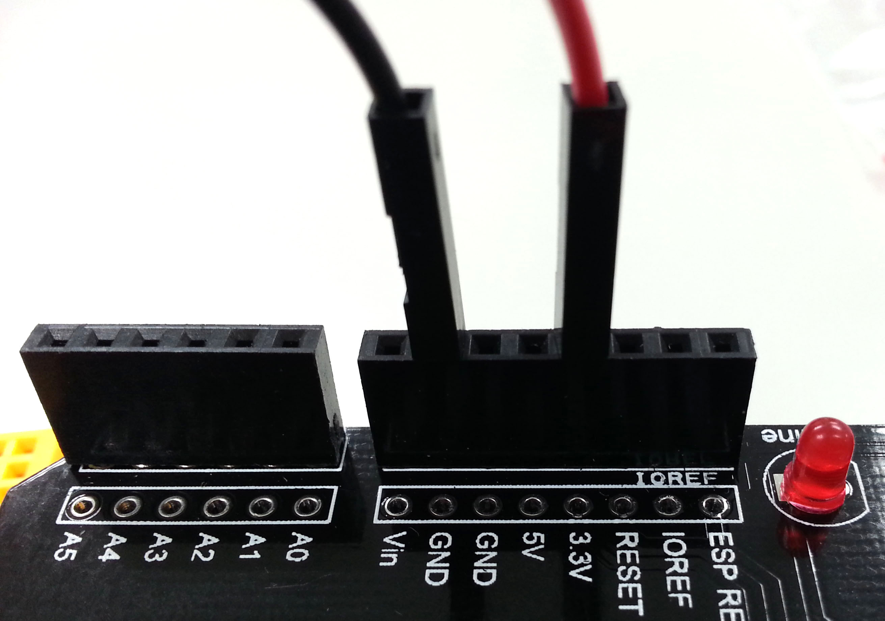
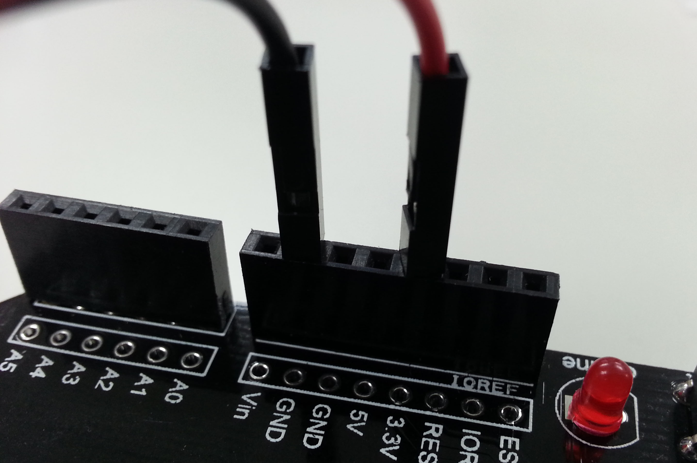

# webduino-learn

# 目錄
- [LED](#LED)
    - [燈泡圖片亮 & LED 燈亮](#燈泡圖片亮--led-燈亮)
    - [點擊燈泡圖片切換 LED 燈開關](#點擊燈泡圖片切換-led-燈開關)
    - [黃亮紅不亮，黃不亮紅亮 切換](#黃亮紅不亮黃不亮紅亮-切換)
    - [紅綠燈](#紅綠燈)
- [超音波傳感器 (Ultrasonic Sensor, HC-SRO4+)](#超音波傳感器-ultrasonic-sensor-hc-sro4)
    - [超音波 顯示 擷取距離](#超音波-顯示-擷取距離)
    - [利用 超音波 擷取距離 縮放圖片大小](#利用-超音波-擷取距離-縮放圖片大小)
- [三色 LED (RGB LED)](#三色-led-rgb-led)
    - [三色 LED 調色盤](#三色-led-調色盤)
    - [點擊按鈕改變 三色 LED 顏色](#點擊按鈕改變-三色-led-顏色)
    - [利用拉霸調整 三色 LED 顏色](#利用拉霸調整-三色-led-顏色)
    - [七彩霓虹燈 - 利用時間改變 三色 LED 燈 顏色](#七彩霓虹燈---利用時間改變-三色-led-燈-顏色)
- [三色 LED (RGB LED) & 超音波傳感器 (Ultrasonic Sensor, HC-SRO4+)](#三色-led-rgb-led--超音波傳感器-ultrasonic-sensor-hc-sro4)
    - [利用超音波改變 三色 LED 燈 顏色](#利用超音波改變-三色-led-燈-顏色)
- [按鈕開關 (Button)](#按鈕開關-button)
    - [監聽按鈕動作 (按下、放開、長按)](#監聽按鈕動作-按下放開長按)
    - [按鈕 按下 + 1、按住 歸 0](#按鈕-按下--1按住-歸-0)
    - [按按鈕 比賽跑](#按按鈕-比賽跑)
- [人體紅外線偵測傳感器 (PIR sensor, Passive infrared sensor) & LED](#人體紅外線偵測傳感器-pir-sensor-passive-infrared-sensor--led)
    - [人體紅外線偵測傳感器 控制 LED](#人體紅外線偵測傳感器-控制-led)
- [溫濕度傳感器 (Humidity and Temperature Sensor, DHT11)](#溫濕度傳感器-humidity-and-temperature-sensor-dht11)
    - [顯示溫度、濕度](#顯示溫度濕度)
    - [利用 Google Charts 繪製溫濕度圖表](#利用-google-charts-繪製溫濕度圖表)
    - [利用 Google Charts 繪製溫濕度指針](#利用-google-charts-繪製溫濕度指針)
    - [利用 Firebase 記錄溫濕度](#利用-firebase-記錄溫濕度)
- [蜂鳴器 (Buzzer)](#蜂鳴器-buzzer)
    - [嗡鳴器發出「獻給愛麗絲」](#嗡鳴器發出獻給愛麗絲)
- [聲音偵測傳感器 (Sound Detector Sensor)](#聲音偵測傳感器-sound-detector-sensor)
    - [聲音偵測傳感器 偵測是否有聲音](#聲音偵測傳感器-偵測是否有聲音)
- [伺服馬達 (Servomotor, SG90)](#伺服馬達-servomotor-sg90)
    - [控制 伺服馬達 轉動角度](#控制-伺服馬達-轉動角度)

---

# [LED](./LED)
<a href="./image/LED.jpg" target="_blank"></a>

[Webduino 官方教學範例 - LED 燈](https://webduino.io/tutorials/tutorial-01-led.html)

## [燈泡圖片亮 & LED 燈亮](./LED/LED_bright.html)

### 接線
- GND (接地)：LED 短腳
- 10：LED 長腳

### 實際接線照片
<a href="./image/LEDx1_1.jpg" target="_blank"></a>
<a href="./image/LEDx1_2.jpg" target="_blank"></a>
<a href="./image/LEDx1_3.jpg" target="_blank"></a>

```javascript
var led;

boardReady({device: 'wa8w'}, board => {
    board.systemReset();
    board.samplingInterval = 250;
    led = getLed(board, 10);
    led.on();
    document.getElementById("light").className = "on";
});
```

---

## [點擊燈泡圖片切換 LED 燈開關](./LED/Switch_LED.html)
### 接線
- GND (接地)：LED 短腳
- 10：LED 長腳

```javascript
var led;
var light = document.getElementById("light");

boardReady({device: 'wa8w'}, board => {
    board.systemReset();
    board.samplingInterval = 250;
    led = getLed(board, 10);
    led.off();
    light.className = "off";
    light.addEventListener("click", () => {
        led.toggle();
        light.className = light.className == "on" ? "off" : "on";
    });
});
```

---

## 黃亮紅不亮，黃不亮紅亮 切換
### 接線
- GND (接地)：LED 短腳
- 10：紅 LED 長腳
- 11：黃 LED 長腳

### 實際接線照片
<a href="./image/Click_Switch_Yellow-Red_LED_1.jpg" target="_blank"></a>

### [點擊燈泡圖片 切換](./LED/Click_Switch_Yellow-Red_LED.html)
```javascript
var led_red, led_yellow;
var light = document.getElementById("light");

boardReady({device: 'wa8w'}, board => {
    board.systemReset();
    board.samplingInterval = 250;
    led_red = getLed(board, 10);
    led_yellow = getLed(board, 11);
    led_red.off();
    led_yellow.on();
    light.className = "off";
    light.addEventListener("click", () => {
        led_red.toggle();
        led_yellow.toggle();
        light.className = light.className == "on" ? "off" : "on";
    });
});
```

---

### [自動間隔幾秒後 切換](./LED/Auto_Switch_Yellow-Red_LED.html)
```javascript
var led_red, led_yellow;
var light = document.getElementById("light");

boardReady({device: 'wa8w'}, board => {
    board.systemReset();
    board.samplingInterval = 250;
    led_red = getLed(board, 10);
    led_yellow = getLed(board, 11);
    led_red.off();
    led_yellow.on();
    light.className = "off";
    setInterval(() => {
        led_red.toggle();
        led_yellow.toggle();
        light.className = light.className == "on" ? "off" : "on";
    }, 2000);
});
```

Demo：

<a href="./image/Click_Switch_Yellow-Red_LED_2.gif" target="_blank"></a>

---

## [紅綠燈](./LED/Traffic-light.html)

### 接線
- GND (接地)：LED 短腳
- 10：紅 LED 長腳
- 11：黃 LED 長腳
- 7：綠 LED 長腳

### 實際接線照片
<a href="./image/Auto_Switch_Yellow-Red_LED_3.jpg" target="_blank"></a>
<a href="./image/Auto_Switch_Yellow-Red_LED_2.jpg" target="_blank"></a>
<a href="./image/Auto_Switch_Yellow-Red_LED_1.jpg" target="_blank"></a>

說明：
- 開始綠燈亮，可按 點擊燈泡圖片 切換 紅燈 或 綠燈 狀態
- 切換紅燈狀態：點擊燈泡圖片 2 秒後換黃燈亮 (其他不亮)，再 2 秒後換紅燈亮 (其他不亮)
- 切換綠燈狀態：點擊燈泡圖片 2 秒後換綠燈亮 (其他不亮)

```javascript
var led_red, led_yellow, led_green;
var light = document.getElementById("light");

(async function () {
    boardReady({device: 'wa8w'}, async board => {
        board.systemReset();
        board.samplingInterval = 250;
        led_red = getLed(board, 10);
        led_yellow = getLed(board, 11);
        led_green = getLed(board, 7);
        led_red.off();
        led_yellow.off();
        led_green.on();
        light.className = "off";
        light.addEventListener("click", Traffic_Light);
    });
}());

async function Traffic_Light() {
    if (light.className == "off") {
        await delay(2);
        led_red.off();
        led_yellow.on();
        led_green.off();
        await delay(2);
        led_red.on();
        led_yellow.off();
        led_green.off();
        light.className = "on";
    } else {
        await delay(2);
        led_red.off();
        led_yellow.off();
        led_green.on();
        light.className = "off";
    }
}
```

Demo：

<a href="./image/Auto_Switch_Yellow-Red_LED_3.jpg" target="_blank"></a>

---

# [超音波傳感器 (Ultrasonic Sensor, HC-SRO4+)](./Ultrasonic_(HC-SRO4%2B))
<a href="./image/HC-SRO4+.jpg" target="_blank"></a>

- VCC：供應電源 (3 ~ 5.5V)
- Trig：超音波觸發信號，訊號發送出去
- Echo：超音波接收結果輸出
- GND：接地

Webduino 官方教學範例
- [超音波 顯示 擷取距離](https://webduino.io/tutorials/tutorial-05-ultrasonic.html)
- [利用 超音波 擷取距離 縮放圖片大小](https://webduino.io/tutorials/tutorial-06-ultrasonic-imagesize.html)

## 接線
- VCC：3.3V
- Trig：11
- Echo：10
- GND：GND

## 實際接線照片
<a href="./image/HC-SRO4+_1.jpg" target="_blank"></a>
<a href="./image/HC-SRO4+_2.jpg" target="_blank"></a>

## [超音波 顯示 擷取距離](./Ultrasonic_(HC-SRO4%2B)/Ultrasonic_Get_Distance.html)

```javascript
var ultrasonic;

boardReady({device: 'kzpV'}, board => {
    board.systemReset();
    board.samplingInterval = 250;
    ultrasonic = getUltrasonic(board, 11, 10);
    ultrasonic.ping(cm => {
        console.log(ultrasonic.distance);
        document.getElementById("show").innerHTML = ultrasonic.distance;
    }, 500);
});
```

## [利用 超音波 擷取距離 縮放圖片大小](./Ultrasonic_(HC-SRO4%2B)/Ultrasonic_Get_Distance_Zoom_Picture.html)

```javascript
var ultrasonic;

boardReady({device: 'kzpV'}, board => {
    board.systemReset();
    board.samplingInterval = 250;
    ultrasonic = getUltrasonic(board, 11, 10);
    ultrasonic.ping(cm => {
        console.log(ultrasonic.distance);
        var imageWidth = ultrasonic.distance;
        var imageHeight = ultrasonic.distance;
        document.getElementById("image").style.width = imageWidth+"px";
        document.getElementById("image").style.height = imageHeight+"px";
    }, 500);
});
```

---

# [三色 LED (RGB LED)](./RGB_LED)
<a href="./image/RGB_LED.jpg" target="_blank"></a>

Webduino 官方教學範例
- [控制三色 LED](https://webduino.io/tutorials/tutorial-03-rgbled.html)
- [三色 LED 調色盤](https://webduino.io/tutorials/tutorial-04-rgbled-palette.html)

## 接線
- V：3.3V
- R：10
- B：6
- G：9

## 實際接線照片
<a href="./image/RGB_LED_1.jpg" target="_blank"></a>
<a href="./image/RGB_LED_2.jpg" target="_blank"></a>
<a href="./image/RGB_LED_3.jpg" target="_blank"></a>
<a href="./image/RGB_LED_4.jpg" target="_blank"></a>

## [三色 LED 調色盤](./RGB_LED/RGB_LED_Change_Color.html)

```javascript
var rgbled;

boardReady({device: 'wa8w'}, board => {
    board.systemReset();
    board.samplingInterval = 250;
    rgbled = getRGBLed(board, 10, 9, 6);
    document.getElementById("color").oninput = _color => {
        _color = this.value;
        rgbled.setColor(_color);
    };
});
```

Demo：

<a href="./image/RGB_LED_Change_Color.png" target="_blank"></a>

---

## [點擊按鈕改變 三色 LED 顏色](./RGB_LED/RGB_LED_Click_Button_Change_Color.html)

```javascript
var rgbled;

boardReady({device: 'wa8w'}, board => {
    board.systemReset();
    board.samplingInterval = 250;
    rgbled = getRGBLed(board, 10, 9, 6);
    rgbled.setColor('#000000');
    document.getElementById("show").style.background = '#000';
    changeColor("redBtn", '#f00');
    changeColor("greenBtn", '#3f3');
    changeColor("blueBtn", '#33f');
    changeColor("clearBtn", '#000');
});

function changeColor(btn, color) {
    document.getElementById(btn).addEventListener("click",() => {
        rgbled.setColor(color);
        document.getElementById("show").style.background = color;
    });
}
```

Demo：

<a href="./image/RGB_LED_Click_Button_Change_Color.png" target="_blank"></a>

---

## [利用拉霸調整 三色 LED 顏色](./RGB_LED/RGB_LED_SliderBar_Change_Color.html)

```javascript
var rgbled;
var color = {"red": "00", "green": "00", "blue": "00"};

boardReady({device: 'wa8w'}, board => {
    board.systemReset();
    board.samplingInterval = 250;
    rgbled = getRGBLed(board, 10, 9, 6);
    rgbled.setColor('#000');
    document.getElementById("show").style.background = '#000';
    document.getElementById("red").addEventListener("change", changeColor);
    document.getElementById("green").addEventListener("change", changeColor);
    document.getElementById("blue").addEventListener("change", changeColor);
});

function changeColor(e) {
    var id = e.target.id;
    color[id] = e.target.value * 1;
    color[id] = color[id] < 17 ? "0" + color[id].toString(16) : color[id].toString(16);
    var rgb = "#" + color.red + color.green + color.blue;
    rgbled.setColor(rgb);
    document.getElementById("show").style.background = rgb;
}
```

Demo：

<a href="./image/RGB_LED_SliderBar_Change_Color.png" target="_blank"></a>

---

## [七彩霓虹燈 - 利用時間改變 三色 LED 燈 顏色](./RGB_LED/RGB_LED_Colorful_Neon_lighting.html)

```javascript
var rgbled, timer, time = 300;
var light = document.getElementById("light");

boardReady({device: 'wa8w'}, board => {
    board.systemReset();
    board.samplingInterval = 250;
    rgbled = getRGBLed(board, 10, 9, 6);
    rgbled.setColor('#000');
    light.setAttribute("class","off");
    light.addEventListener("click", () => {
        if (light.getAttribute("class") == "off") {
            light.className = "on";
            rgbled.setColor('#000');
            repeat();
        } else {
            light.className = "off";
            rgbled.setColor('#000');
            clearTimeout(timer);
        }
    });
});

function delay(time) {
    return new Promise(resolve => timer = setTimeout(resolve, time));
}

function repeat() {
    delay(1).then(() => { rgbled.setColor('#f00'); return delay(time);
    }).then(() => { rgbled.setColor('#f90'); return delay(time);
    }).then(() => { rgbled.setColor('#ff3'); return delay(time);
    }).then(() => { rgbled.setColor('#3f3'); return delay(time);
    }).then(() => { rgbled.setColor('#33f'); return delay(time);
    }).then(() => { rgbled.setColor('#c6c'); return delay(time);
    }).then(() => repeat());
}
```

---

# [三色 LED (RGB LED) & 超音波傳感器 (Ultrasonic Sensor, HC-SRO4+)](./RGB_LED&Ultrasonic_(HC-SRO4%2B))

[Webduino 官方教學範例 - 利用超音波改變 三色 LED 燈 顏色](https://webduino.io/tutorials/tutorial-08-ultrasonic-rgbled.html)

## 接線
- 三色LED (RGB LED)
    - V：3.3V
    - R：10
    - B：6
    - G：9
- 超音波傳感器 (Ultrasonic Sensor, HC-SRO4+)
    - VCC：5V
    - Trig：7
    - Echo：8
    - GND：GND

## 實際接線照片
<a href="./image/RGB_LED&HC-SRO4+_2.jpg" target="_blank"></a>
<a href="./image/RGB_LED&HC-SRO4+_3.jpg" target="_blank"></a>
<a href="./image/RGB_LED&HC-SRO4+_1.jpg" target="_blank"></a>
<a href="./image/RGB_LED&HC-SRO4+_5.jpg" target="_blank"></a>
<a href="./image/RGB_LED&HC-SRO4+_4.jpg" target="_blank"></a>

## [利用超音波改變 三色 LED 燈 顏色](./RGB_LED&Ultrasonic_(HC-SRO4%2B)/Ultrasonic_Change_RGB_LED_Color.html)

```javascript
var rgbled, ultrasonic, i = 0;
var color = ["#f00", "#f90", "#ff0", "#3f3", "#33f", "#c6c"];
var show = document.getElementById("show");

boardReady({device: 'kzpV'}, board => {
    board.systemReset();
    board.samplingInterval = 250;
    rgbled = getRGBLed(board, 10, 9, 6);
    ultrasonic = getUltrasonic(board, 7, 8);
    rgbled.setColor('#000');
    show.style.background = '#000';
    ultrasonic.ping(cm => {
        console.log(ultrasonic.distance);
        i = Math.floor(ultrasonic.distance / 10);
        if (ultrasonic.distance < 50) {
            rgbled.setColor(color[i]);
            show.style.background = color[i];
        } else {
            rgbled.setColor(color[5]);
            show.style.background = color[5];
        }
    }, 500);
});
```

---

# [按鈕開關 (Button)](./Button)
<a href="./image/Button.jpg" target="_blank"></a>

[Webduino 官方教學範例 - 按鈕開關](https://webduino.io/tutorials/tutorial-09-button-led.html)

## 接線
利用麵包板中間斷路的設計，將按鈕開關各邊的兩腳橫跨兩邊，才能讓四腳都通路，然後再用電阻連接 GND (為了避免有短路的可能發生，所以要接一顆電阻進行保護)

- 按鈕開關 (Button)
    - 3.3V
    - 11
    - 按鈕開關 → 電阻 → GND

## 實際接線照片
<a href="./image/Button_1.jpg" target="_blank"></a>
<a href="./image/Button_2.jpg" target="_blank"></a>
<a href="./image/Button_3.jpg" target="_blank"></a>
<a href="./image/Button_4.jpg" target="_blank"></a>
<a href="./image/Button_5.jpg" target="_blank"></a>

## [監聽按鈕動作 (按下、放開、長按)](./Button/Listen_Button_Action.html)

```javascript
var button;
var show = document.getElementById("show");

boardReady({device: 'kzpV'}, board => {
    board.systemReset();
    board.samplingInterval = 250;
    button = getButton(board, 11);
    button.on("pressed", () => show.innerHTML = '按下');
    button.on("released", () => show.innerHTML = '放開');
    button.on("longPress", () => show.innerHTML = '長按');
});
```

---

## [按鈕 按下 + 1、按住 歸 0](./Button/Button_Press_Count.html)

```javascript
var button, count = 0;
var show = document.getElementById("show");

boardReady({device: 'kzpV'}, board => {
    board.systemReset();
    board.samplingInterval = 250;
    button = getButton(board, 11);
    show.innerHTML = 0;
    button.on("pressed", () => show.innerHTML = count++);
    button.on("longPress", () => show.innerHTML = count = 0);
});
```

---

## [按按鈕 比賽跑](./Button/Button_Press_Count.html)

```javascript
var button;
var NpcShow = document.getElementById("npcshow"),
    UserShow = document.getElementById("usershow"),
    Npc = document.getElementById("npc"),
    User = document.getElementById("user"),
    Start = document.getElementById("start"),
    Timer, GameA = 0, GameB = 0,
    Distance = 100,
    NpcSpeed = 2, UserSpeed;

boardReady({device: 'wa8w'}, function (board) {
    board.systemReset();
    board.samplingInterval = 250;
    button = getButton(board, 11);

    Start.className = "";
    document.getElementById("goal").innerHTML = Distance;
    Start.addEventListener("click",go);
});

function go() {
    Start.className = "go";
    GameA = 0, GameB = 0;
    button.on("pressed", userRun);
    Timer = setInterval(NPCRun, 120);
}

function userRun() {
    UserShow.innerHTML = GameA += 5;
    User.style.marginLeft = GameA + "px";
    if (GameA >= Distance) {
        alert("You Win !!!");
        stop();
    }
}

function NPCRun() {
    NpcShow.innerHTML = GameB += NpcSpeed;
    Npc.style.marginLeft = GameB + "px";
    if (GameB >= Distance) {
        alert("GAME OVER !!! You Lose !!!");
        stop();
    }
}

function stop() {
    clearInterval(Timer);
    GameA = 0, GameB = 0;
    NpcShow.innerHTML = 0;
    UserShow.innerHTML = 0;
    Npc.style.marginLeft = 0;
    User.style.marginLeft = 0;
    Start.className = "";
    button.removeAllListeners("pressed");
}
```

Demo：

<a href="./image/Press_Button_Race_Run.png" target="_blank"></a>

---

# [人體紅外線偵測傳感器 (PIR sensor, Passive infrared sensor) & LED](./PIR&LED)
<a href="./image/PIR_1.jpg" target="_blank"></a>
<a href="./image/PIR_2.jpg" target="_blank"></a>

[Webduino 官方教學範例 - 人體紅外線偵測傳感器 控制 LED](https://webduino.io/tutorials/tutorial-15-pir-led.html)

## 接線
- 人體紅外線偵測傳感器 (PIR sensor)
    - GND：GND
    - OUT：11
    - VCC：5V
- LED
    - 長腳：10
    - 短腳：GND

## 實際接線照片
<a href="./image/PIR&LED_1.jpg" target="_blank"></a>
<a href="./image/PIR&LED_2.jpg" target="_blank"></a>
<a href="./image/PIR&LED_3.jpg" target="_blank"></a>
<a href="./image/PIR&LED_4.jpg" target="_blank"></a>
<a href="./image/PIR&LED_5.jpg" target="_blank"></a>

## [人體紅外線偵測傳感器 控制 LED](./PIR&LED/PIR_Control_LED.html)

```javascript
var pir, led;
var light = document.getElementById("light");

boardReady({device: 'wa8w'}, board => {
    board.systemReset();
    board.samplingInterval = 250;
    pir = getPir(board, 11);
    led = getLed(board, 10);
    led.off();
    pir.on("detected", () => {
        light.className = "on";
        led.on();
    });
    pir.on("ended", () => {
        light.className = "off";
        led.off();
    });
});
```

---

# [溫濕度傳感器 (Humidity and Temperature Sensor, DHT11)](./Humidity_Temperature_(DHT11))
<a href="./image/DHT11.jpg" target="_blank"></a>

Webduino 官方教學範例
- [溫濕度傳感器](https://webduino.io/tutorials/tutorial-10-temperature-humidity-sensor.html)
- [使用 Firebase 資料庫記錄溫濕度](https://webduino.io/tutorials/tutorial-29-firebase-dht.html)

## 接線
- VCC：3.3V
- Data：11
- N/C：沒有作用
- GND：GND

## 實際接線照片
<a href="./image/DHT11_1.jpg" target="_blank"></a>
<a href="./image/DHT11_2.jpg" target="_blank"></a>
<a href="./image/DHT11_3.jpg" target="_blank"></a>

## [顯示溫度、濕度](./Humidity_Temperature_(DHT11)/Humidity_Temperature.html)

```javascript
var dht;

boardReady({device: 'wa8w'}, board => {
    board.systemReset();
    board.samplingInterval = 250;
    dht = getDht(board, 11);
    dht.read(evt => {
        document.getElementById("temperature").innerHTML = dht.temperature;
        document.getElementById("humidity").innerHTML = dht.humidity;
    }, 1000);
});
```

---

## [利用 Google Charts 繪製溫濕度圖表](./Humidity_Temperature_(DHT11)/Humidity_Temperature-Google_Charts.html)

```javascript
var dht;
var chart_div = document.getElementById("chart_div");

boardReady({device: 'wa8w'}, board => {
    board.systemReset();
    board.samplingInterval = 20;
    dht = getDht(board, 11);

    var areachart = {
        areachart: false,
        origin: [["時間", "溫度 (℃)", "濕度 (%)"]]
    };

    google.load("visualization", "1", {
        packages: ["corechart"],
        callback: () => areachart.areachart = true
    });
    
    dht.read(evt => {
        document.getElementById("temperature").innerHTML = dht.temperature;
        document.getElementById("humidity").innerHTML =  dht.humidity;
        var time = new Date();
        var ts = time.getSeconds();
        var tm = time.getMinutes();
        var th = time.getHours();
        var a = [];
        if (areachart.areachart) {
            chart_div.style.display = "block";
            a[0] = th + ":" + tm + ":" + ts;
            a[1] = dht.temperature;
            a[2] = dht.humidity;
            areachart.origin.push(a);
            drawAreaChart(areachart.origin);
        }
        if (areachart.gauge) {
            chart_div.style.display = "none";
            areachart.origin1 = [["Label", "Value"], ["humidity", humidity]];
            areachart.origin2 = [["Label", "Value"], ["temperature", temperature]];
            drawGuage(areachart.origin1, areachart.origin2);
        }
    }, 1000);
});

function drawAreaChart(d) {
    if (!Array.isArray(d)) return;
    var titleTextStyle = {
        fontName: "微軟正黑體",
        bold: true,
        italic: false
    };
    var data = google.visualization.arrayToDataTable(d);
    var options = {
        title: "",
        hAxis: {title: "時間", titleTextStyle: titleTextStyle},
        vAxis: {title: "溫濕度", minValue: 0, titleTextStyle: titleTextStyle},
        chartArea: {top: 50, left: 50, width: "70%", height: "70%"},
        colors: ['#f00', '#00f']
    };
    var code = new google.visualization.AreaChart(chart_div);
    return code.draw(data, options);
}
```

Demo：

<a href="./image/Humidity_Temperature-Google_Charts.png" target="_blank"></a>

---

## [利用 Google Charts 繪製溫濕度指針](./Humidity_Temperature_(DHT11)/Humidity_Temperature-Pointer.html)

```javascript
var dht;
var gauge;
var chart_div = document.getElementById("chart_div");
var chart_div1 = document.getElementById("chart_div1");
var chart_div2 = document.getElementById("chart_div2");
var temperature = document.getElementById("temperature");
var humidity = document.getElementById("humidity");

boardReady({device: 'wa8w'}, function (board) {
    board.systemReset();
    board.samplingInterval = 20;
    dht = getDht(board, 11);

    var gauge = {
        guage: false,
        origin1: [
            ["Label", "Value"], ["humidity", 55]
        ],
        origin2: [
            ["Label", "Value"], ["temperature", 30]
        ]
    };
    google.load("visualization", "1", {
        packages: ["gauge"],
        callback: () => gauge.gauge = true
    });
    
    dht.read(evt => {
        temperature.innerHTML = dht.temperature;
        humidity.innerHTML =  dht.humidity;
        var time = new Date();
        var ts = time.getSeconds();
        var tm = time.getMinutes();
        var th = time.getHours();
        var a = [];
        if (gauge.areachart) {
            chart_div.style.display="block";
            chart_div1.style.display="none";
            chart_div2.style.display="none";
            a[0] = th + ":" + tm + ":" + ts;
            a[1] = dht.temperature;
            a[2] = dht.humidity;
            gauge.origin.push(a);
            drawAreaChart(gauge.origin);
        }
        if (gauge.gauge) {
            chart_div.style.display="none";
            chart_div1.style.display="inline-block";
            chart_div2.style.display="inline-block";
            gauge.origin1 = [["Label", "Value"],["humidity", dht.humidity]];
            gauge.origin2 = [["Label", "Value"],["temperature", dht.temperature]];
            drawGuage(gauge.origin1,gauge.origin2);
        }
    }, 1000);
});

function drawGuage(d1,d2) {
    if (!Array.isArray(d1) || !Array.isArray(d2))
        return;
    var data1 = google.visualization.arrayToDataTable(d1);
    var data2 = google.visualization.arrayToDataTable(d2);
    var options1 = {
        width: 400, height: 200,
        redFrom: 90, redTo: 100,
        yellowFrom:75, yellowTo: 90,
        minorTicks: 5,
        redColor:"#00f", yellowColor:"#9cf",
        animation:{easing:"in"}
    };
    var options2 = {
        width: 400, height: 200,
        redFrom: 90, redTo: 100,
        yellowFrom:75, yellowTo: 90,
        minorTicks: 5,
        animation:{easing:"in"}
    };
    var chart1 = new google.visualization.Gauge(chart_div1);
    chart1.draw(data1, options1);
    var chart2 = new google.visualization.Gauge(chart_div2);
    chart2.draw(data2, options2);
}
```

Demo：

<a href="./image/Humidity_Temperature-Pointer.png" target="_blank"></a>

---

## [利用 Firebase 記錄溫濕度](./Humidity_Temperature_(DHT11)/Humidity_Temperature-Firebase.html)

[詳細教學說明](./Humidity_Temperature_(DHT11)/Humidity_Temperature-Firebase-README.md)

```javascript
var dht, myFirebase;
var temperature = document.getElementById("temperature");
var humidity = document.getElementById("humidity");

boardReady({device: 'kzpV'}, board => {
    board.systemReset();
    board.samplingInterval = 20;
    dht = getDht(board, 10);
    myFirebase = new Firebase("https://<Your-Firebase>.firebaseio.com/");
    dht.read(evt => {
        temperature.innerHTML = dht.temperature;
        humidity.innerHTML = dht.humidity;
        myFirebase.push({
            date: get_date(),
            time: get_time(),
            temperature: dht.temperature,
            humidity: dht.humidity
        });
    }, 1000);
});

function get_date() {
    var nowDay = new Date(),
        nowYear = nowDay.getFullYear(),
        nowMonth = nowDay.getMonth() + 1,
        nowDate = nowDay.getDate();
    return nowYear + "/" + nowMonth + "/" + nowDate;
}
  
function get_time() {
    var nowTime = new Date(),
        nowHours = nowTime.getHours(),
        nowMinutes = nowTime.getMinutes(),
        nowSeconds = nowTime.getSeconds();
    return nowHours + ":" + nowMinutes + ":" + nowSeconds;
}
```

---

# [蜂鳴器 (Buzzer)](./Buzzer)
<a href="./image/Buzzer.png" target="_blank"></a>

[Webduino 官方教學範例 - 蜂鳴器](https://webduino.io/tutorials/tutorial-13-buzzer.html)

## 接線
- 正極：11
- 負極：GND

## [嗡鳴器發出「獻給愛麗絲」](./Buzzer/Buzzer-Fur_Elise.html)

```javascript
var buzzer;
// 獻給愛麗絲
var music = [
    {notes:"E4",tempos:"6"}, {notes:"DS4",tempos:"6"}, {notes:"E4",tempos:"4"}, {notes:"DS4",tempos:"4"},
    {notes:"E4",tempos:"4"}, {notes:"B3",tempos:"4"}, {notes:"D4",tempos:"4"}, {notes:"C4",tempos:"4"},
    {notes:"A3",tempos:"4"}, {notes:"0",tempos:"4"}, {notes:"C3",tempos:"6"}, {notes:"E3",tempos:"6"},
    {notes:"A3",tempos:"6"}, {notes:"B3",tempos:"4"}, {notes:"0",tempos:"4"}, {notes:"D3",tempos:"6"},
    {notes:"GS3",tempos:"6"}, {notes:"B3",tempos:"6"}, {notes:"C4",tempos:"4"}
];

boardReady({device: 'wa8w'}, board => {
    board.systemReset();
    board.samplingInterval = 20;
    buzzer = getBuzzer(board, 11);
    buzzer.play(buzzer_music(music).notes ,buzzer_music(music).tempos);
});

function buzzer_music(m) {
    var musicNotes = { notes: [], tempos: [] };
    if (m[0].notes.length > 1) {
        for (var i = 0; i < m.length; i++) {
            if (Array.isArray(m[i].notes))
                musicNotes.notes = musicNotes.notes.concat(m[i].notes);
            else
                musicNotes.notes.push(m[i].notes);
            if (Array.isArray(m[i].tempos))
                musicNotes.tempos = musicNotes.tempos.concat(m[i].tempos);
            else
                musicNotes.tempos.push(m[i].tempos);
        }
    } else {
        musicNotes.notes = [m[0].notes];
        musicNotes.tempos = [m[0].tempos];
    }
    return musicNotes;
}
```

---

# [聲音偵測傳感器 (Sound Detector Sensor)](./Sound_Detector_Sensor)
<a href="./image/Sound_Detector_Sensor_1.jpg" target="_blank"></a> <a href="./image/Sound_Detector_Sensor_2.jpg" target="_blank"></a>

主要用於偵測是否有聲音，在聲音偵測傳感器上有一個十字旋鈕，可用螺絲起子自行調整零敏度

[Webduino 官方教學範例 - 聲音偵測傳感器](https://webduino.io/tutorials/tutorial-12-sound-sensor.html)

## 接線
- GND：GND
- OUT：10
- 5V：5V

## [聲音偵測傳感器 偵測是否有聲音](./Sound_Detector_Sensor/Sound_Detector_Sensor-Has_Sound.html)

```javascript
var sound;
var demo = document.getElementById("demo");

boardReady({device: 'wa8w'}, board => {
    board.systemReset();
    board.samplingInterval = 20;
    sound = getSound(board, 10);
    sound.on("detected", () => demo.innerHTML = "有聲音");
    sound.on("ended", () => demo.innerHTML = "沒聲音");
});
```

---

# [伺服馬達 (Servomotor, SG90)](./Servomotor_SG90)
<a href="./image/SG90.jpg" target="_blank"></a>

伺服馬達有機械結構上的限制，旋轉角度大約為 180 度，可能是 1 ~ 180 度，也可能是 -5 度到 174 度...等

[Webduino 官方教學範例 - 伺服馬達](https://webduino.io/tutorials/tutorial-16-servo.html)

## 接線
- 橘：11
- 紅：5V
- 棕：GND

## [控制 伺服馬達 轉動角度](./Servomotor_SG90/Servomotor_Turn.html)

```javascript
var servo;
var bar = document.getElementById("bar");
var bar_value = document.getElementById("bar_value");

boardReady({device: 'wa8w'}, board => {
    board.systemReset();
    board.samplingInterval = 20;
    servo = getServo(board, 11);

    bar.setAttribute("min",0);
    bar.setAttribute("max",180);
    bar.setAttribute("step",5);
    bar.setAttribute("value",90);
    bar.oninput = _value => {
        _value = bar.value;
        bar_value.innerHTML = _value;
        servo.angle = _value;
    };
});
```

Demo：

<a href="./image/Servomotor_Turn.png" target="_blank"></a>