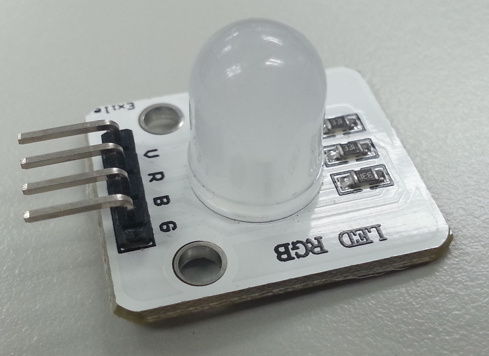
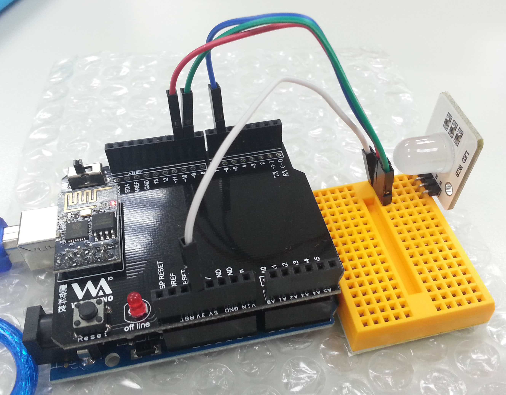
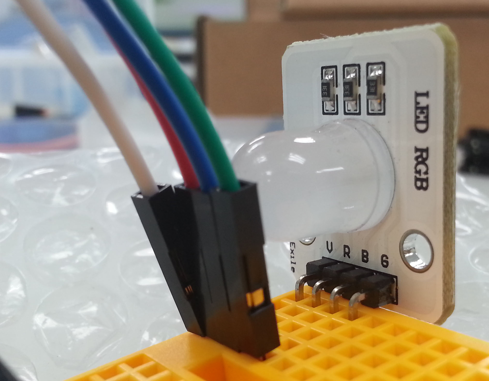
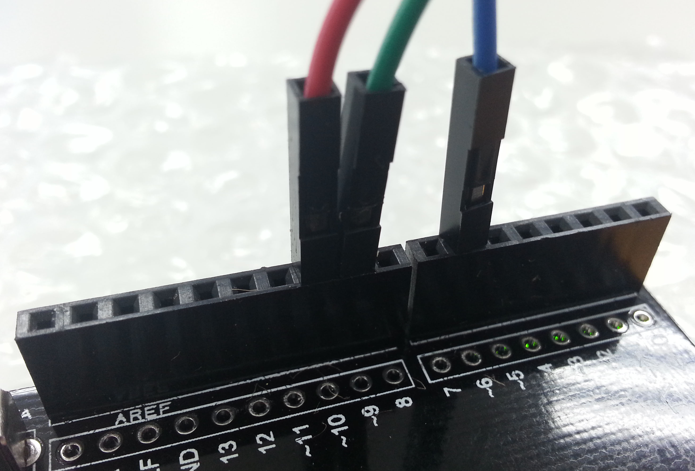
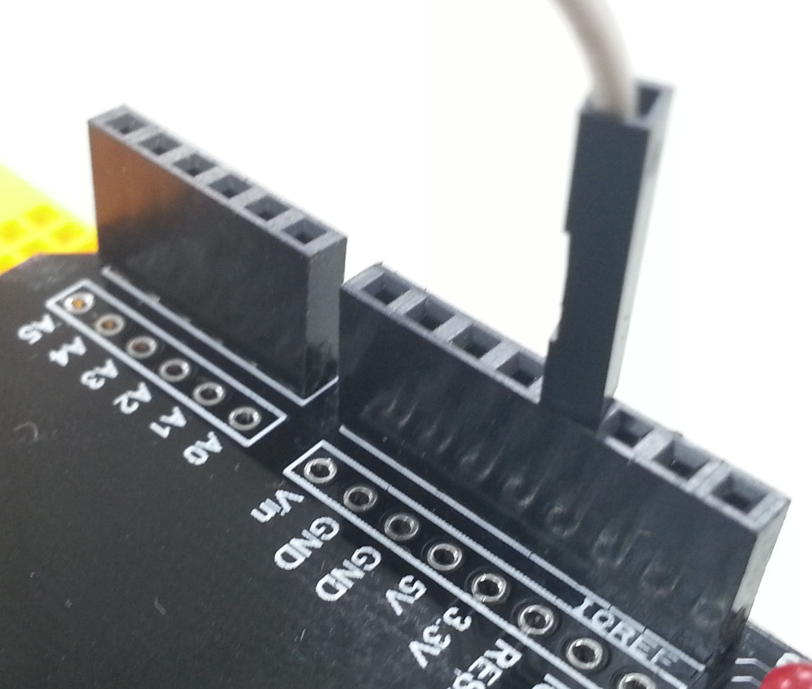
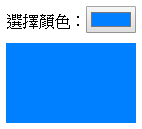

# RGB LED
<a href="./image/RGB_LED.jpg" target="_blank"></a>

[Webduino 官方教學範例 - 三色 LED](https://webduino.io/tutorials/tutorial-03-rgbled.html)

## 接線
- V：3.3V
- R：10
- B：6
- G：9

## 實際接線照片
<a href="./image/RGB_LED_1.jpg" target="_blank"></a>
<a href="./image/RGB_LED_2.jpg" target="_blank"></a>
<a href="./image/RGB_LED_3.jpg" target="_blank"></a>
<a href="./image/RGB_LED_4.jpg" target="_blank"></a>

## [選擇某顏色就變該顏色](./RGB_LED_Change_Color.html)

```javascript
var rgbled;

boardReady({device: 'wa8w'}, board => {
    board.systemReset();
    board.samplingInterval = 250;
    rgbled = getRGBLed(board, 10, 9, 6);
    document.getElementById("color").oninput = _color => {
        _color = this.value;
        rgbled.setColor(_color);
    };
});
```

Demo：

<a href="./image/RGB_LED_Change_Color.png" target="_blank"></a>