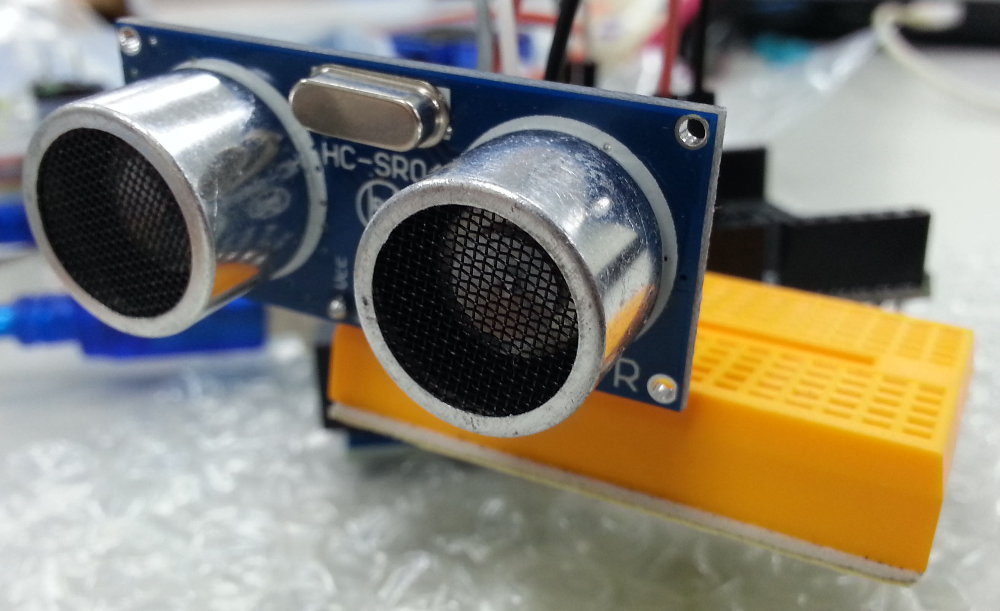
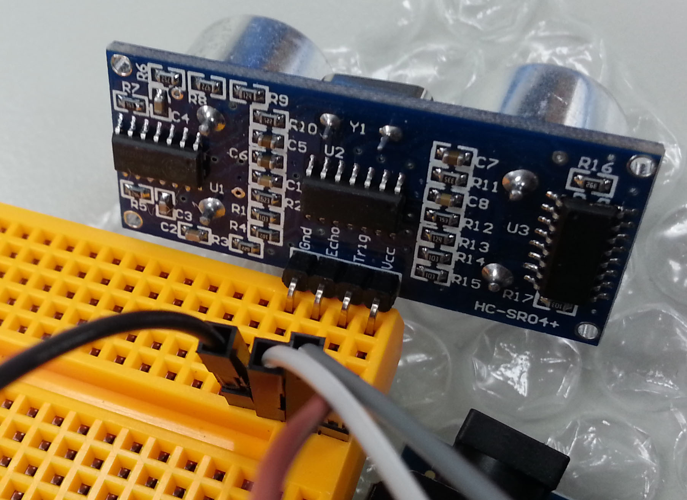
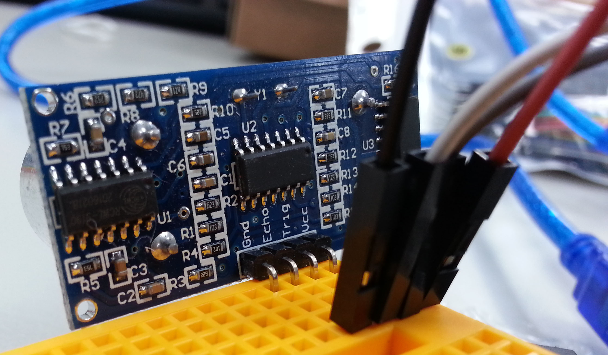

# 超音波
<a href="./image/HC-SRO4+.jpg" target="_blank"></a>

- VCC：供應電源 (3 ~ 5.5V)
- Trig：超音波觸發信號，訊號發送出去
- Echo：超音波接收結果輸出
- GND：接地

## 接線
VCC：3.3V
Trig：11
Echo：10
GND：GND

## 實際接線照片
<a href="./image/HC-SRO4+_1.jpg" target="_blank"></a>
<a href="./image/HC-SRO4+_2.jpg" target="_blank"></a>

## [超音波 顯示 擷取距離](./Get_Distance.html)

```javascript
var ultrasonic;

boardReady({device: 'kzpV'}, board => {
    board.systemReset();
    board.samplingInterval = 250;
    ultrasonic = getUltrasonic(board, 11, 10);
    ultrasonic.ping(cm => {
        console.log(ultrasonic.distance);
        document.getElementById("show").innerHTML = ultrasonic.distance;
    }, 500);
});
```

## [利用 超音波 擷取距離 縮放圖片大小](./Get_Distance_Zoom_Picture.html)

```javascript
var ultrasonic;

boardReady({device: 'kzpV'}, board => {
    board.systemReset();
    board.samplingInterval = 250;
    ultrasonic = getUltrasonic(board, 11, 10);
    ultrasonic.ping(cm => {
        console.log(ultrasonic.distance);
        var imageWidth = ultrasonic.distance;
        var imageHeight = ultrasonic.distance;
        document.getElementById("image").style.width = imageWidth+"px";
        document.getElementById("image").style.height = imageHeight+"px";
    }, 500);
});
```